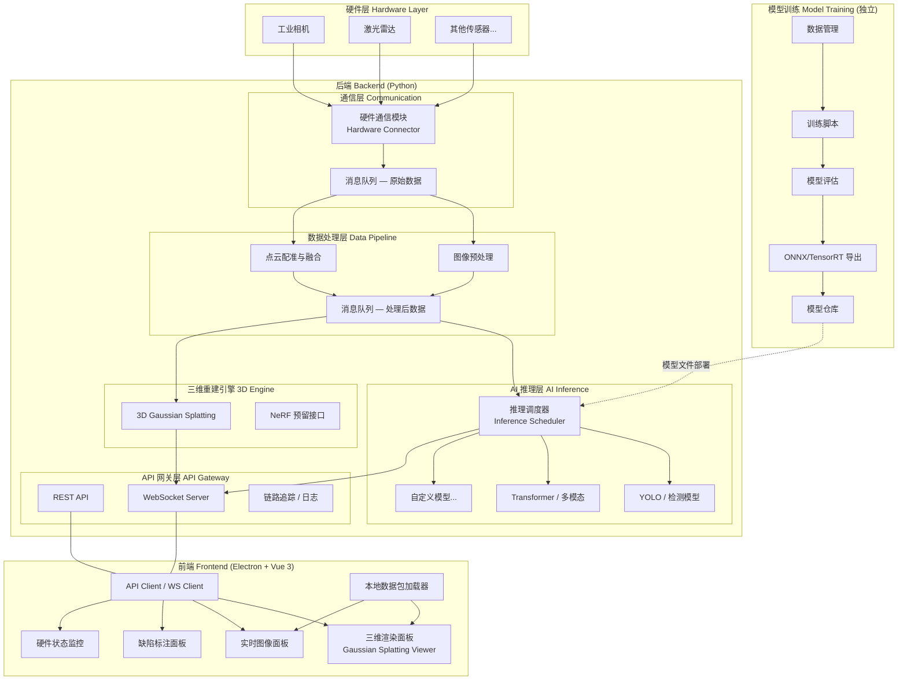

# 工业检测平台 — 系统架构设计

## 整体架构图



## 各层职责与边界

### 硬件通信层 `backend/communication/`

| 项目 | 说明 |
|------|------|
| **职责** | 与工业相机、激光雷达等硬件设备建立连接，接收原始数据流（图像帧、点云帧、传感器读数） |
| **输入** | 硬件厂商 SDK / GigE Vision / GenICam / 自定义 TCP 协议 |
| **输出** | 标准化的原始数据帧 → 推入消息队列 |
| **边界** | 仅负责数据接入，不做任何业务处理。不关心上层是推理还是重建 |

关键设计决策：
- 每种硬件对应一个独立的 `Connector` 类实现统一接口 `BaseConnector`，方便扩展新型号传感器
- 硬件通信层与数据处理层之间通过 **消息队列（Redis Streams / NATS）** 解耦，硬件断连不影响下游

### 数据处理层 `backend/pipeline/`

| 项目 | 说明 |
|------|------|
| **职责** | 图像去噪/缩放/格式转换、点云降采样/去噪/配准、多传感器时间戳对齐 |
| **输入** | 从消息队列消费原始数据帧 |
| **输出** | 处理后的标准化帧 → 推入消息队列（按 topic 分流：`inference.input`、`reconstruction.input`） |
| **边界** | 只做数据变换，不涉及 AI 推理或业务逻辑 |

### AI 推理层 `backend/inference/`

| 项目 | 说明 |
|------|------|
| **职责** | 加载模型（ONNX / TensorRT），接收图像帧，执行推理，输出检测结果 |
| **输入** | 从消息队列消费 `inference.input` 图像帧 |
| **输出** | 检测结果（缺陷类型、bbox、置信度、mask）→ 推入 `inference.result`，同时通过 WebSocket 推送前端 |
| **边界** | 不知道数据从哪个硬件来、前端如何渲染。唯一职责：给定图像，返回检测结果 |

### 三维重建引擎 `backend/reconstruction/`

| 项目 | 说明 |
|------|------|
| **职责** | 持续接收图像+点云帧，增量式更新三维场景（Gaussian Splatting），生成可渲染的场景数据 |
| **输入** | 从消息队列消费 `reconstruction.input`（图像+点云帧） |
| **输出** | 场景更新数据（高斯球参数、相机位姿）→ 通过 WebSocket 推送前端 |
| **边界** | 不关心缺陷检测结果。重建和推理是两条独立流水线 |

### API 网关层 `backend/gateway/`

| 项目 | 说明 |
|------|------|
| **职责** | 统一的入口：REST API（请求/响应类操作）、WebSocket（实时推送）、请求鉴权、限流、日志 |
| **输入** | 前端 HTTP/WS 请求 |
| **输出** | JSON 序列化响应 |
| **边界** | 纯转发+编排层，不包含任何业务逻辑 |

### 前端 `frontend/`

| 项目 | 说明 |
|------|------|
| **职责** | 渲染三维场景、显示实时图像与检测结果、缺陷标注交互、硬件状态面板 |
| **输入** | WebSocket 实时流 + REST API 查询 + 本地数据包文件 |
| **输出** | 用户交互事件（标注、查询、配置）→ API 调用 |
| **边界** | 不直接访问硬件、不直接加载模型。所有数据通过后端 API 获取，或加载离线数据包 |

### 模型训练 `model-training/`

| 项目 | 说明 |
|------|------|
| **职责** | 数据集管理、模型训练、评估、导出为 ONNX/TensorRT |
| **输入** | 标注数据集、超参配置 |
| **输出** | 训练好的模型文件 → 存入模型仓库 |
| **边界** | 与运行时系统完全分离。不依赖后端或前端代码。可以独立在 GPU 集群上运行 |

## 数据流说明

### 在线检测流程（V1 核心链路）

```
硬件相机 ──[图像帧]──▶ 硬件通信层 ──[原始帧]──▶ 消息队列(raw)
                                                      │
                                          ┌───────────┘
                                          ▼
                                    数据处理层(图像预处理)
                                          │
                                          ▼
                                    消息队列(inference.input)
                                          │
                                          ▼
                                   AI 推理层(模型推理)
                                          │
                            ┌─────────────┼─────────────┐
                            ▼                           ▼
                    消息队列(result)             WebSocket 推送前端
                                                        │
                                          ┌─────────────┘
                                          ▼
                                    前端实时图像 + 检测框叠加显示
```

每一帧携带全局唯一的 `frame_id` 和 `timestamp`，所有中间环节的日志和 trace 都关联该 ID。

### 三维重建流程（V2 核心链路）

```
激光雷达 ──[点云帧]──▶ 硬件通信层 ──[原始帧]──▶ 消息队列(raw)
相机   ──[图像帧]──▶                          │
                                          ┌───┘
                                          ▼
                                    数据处理层(点云配准 + 图像对齐)
                                          │
                                          ▼
                                    消息队列(reconstruction.input)
                                          │
                                          ▼
                              三维重建引擎(Gaussian Splatting)
                                          │
                                          ▼
                                  WebSocket 推送前端
                                          │
                                          ▼
                               前端三维渲染面板(WebGL/WebGPU)
```

### 离线回放流程

```
本地数据包(.pkg / .zip) ──▶ 前端本地加载器 ──▶ 模拟 WebSocket 数据流
                                                    │
                                                    ▼
                                          前端各渲染面板(与在线模式一致)
```

离线模式下后端可以不启动，前端直接解析本地数据包，按时间戳回放。

## 模块间通信方式

| 通信场景 | 方式 | 理由 |
|----------|------|------|
| 后端内部：硬件→处理→推理 | **消息队列 (NATS / Redis Streams)** | 解耦生产者和消费者；削峰填谷；天然支持多消费者（同一帧可同时发给推理和重建）；消息持久化便于回溯 |
| 后端内部：跨模块 RPC 调用 | **gRPC** | 强类型 Protobuf 接口；高性能二进制序列化；流式调用支持（如推理调度器下发任务到多个模型实例） |
| 前端 ↔ 后端：请求/响应 | **REST API** | 通用性强；易于调试；适合配置管理、历史查询等非实时操作 |
| 前端 ↔ 后端：实时数据推送 | **WebSocket** | 低延迟双向通信；适合视频帧、检测结果、三维更新等高频实时数据 |
| 模型训练 → 推理部署 | **文件 + 注册表** | 训练产出 ONNX/TensorRT 模型文件，推理层通过模型注册表热加载 |

### 协议约束

前后端通过 REST API 和 WebSocket 通信，数据格式统一使用 JSON。后端 API 结构由 `gateway/schemas/` 中的 Pydantic 模型定义，前端对应类型定义在 `src/types/` 中手写维护。

## 大模型热插拔设计

### 统一推理接口

```python
# backend/inference/base.py
class BaseInferenceEngine(ABC):
    """所有模型的推理引擎必须实现此接口"""

    @abstractmethod
    def load_model(self, model_path: str, **config) -> None: ...

    @abstractmethod
    def infer(self, image: np.ndarray) -> DetectionResult: ...

    @abstractmethod
    def warm_up(self) -> None: ...

    @abstractmethod
    def get_model_info(self) -> ModelInfo: ...
```

### 模型注册与切换

```
inference/
├── engines/
│   ├── yolo_engine.py           # 实现 BaseInferenceEngine
│   ├── transformer_engine.py    # 实现 BaseInferenceEngine
│   └── multimodal_engine.py     # 实现 BaseInferenceEngine
├── registry.py                  # 模型注册表：name → engine class 映射
└── scheduler.py                 # 推理调度：根据配置加载指定引擎
```

切换模型只需修改配置文件，无需改动调度器代码：

```yaml
# backend/config/inference.yaml
active_models:
  detection:
    engine: multimodal_engine    # 从 yolo_engine 切换过来
    model_path: models/v2/detector.onnx
    device: cuda:0
```

### 热加载流程

1. 运维/用户修改配置文件，指定新模型路径和引擎类型
2. 推理调度器监听配置变更（文件 watch 或 API 触发），创建新引擎实例并调用 `load_model()`
3. 新引擎 `warm_up()` 完成后，调度器原子性地将流量切换到新引擎
4. 旧引擎在 drain 完进行中的请求后安全卸载

## 跨版本演进策略

### V1 → V2：引入三维重建

```
V1 已有:
  相机 → 图像预处理 → AI推理 → 前端图像+缺陷展示

V2 新增:
  激光雷达 → 点云预处理 ─┐
                        ├→ 三维重建引擎(GS) → 前端三维渲染
  相机 → 图像帧 ────────┘   (复用图像帧做纹理映射)
```

- **新增模块**：`backend/communication/lidar_connector.py`、`backend/reconstruction/` 整个目录
- **修改模块**：前端新增三维渲染面板组件；消息队列新增 `reconstruction.input` topic
- **不改动**：AI 推理层完全不受影响
- **前端渐进**：三维面板与图像面板并存，V1 用户使用不受影响

### V2 → V3：三维缺陷标注

```
V3 新增:
  AI推理结果(2D bbox) ──▶ 坐标映射引擎 ──▶ 三维场景标注更新
                           (2D像素 → 3D空间点)
```

- **新增模块**：`backend/pipeline/coordinate_mapper.py`（2D 检测结果投影到 3D 场景）
- **修改模块**：前端缺陷标注面板支持三维空间交互；WebSocket 推送新增标注更新消息
- **不改动**：硬件通信层、三维重建引擎核心算法、模型训练流程

### 架构保障

每个版本的核心变更局限在特定模块内，通过消息队列和统一接口的隔离，确保：
- V1 的推理代码在 V3 中依然可以运行（向后兼容）
- 任意模块可以独立升级、独立回滚
- 新传感器、新模型、新重建算法都可以按同样模式接入
